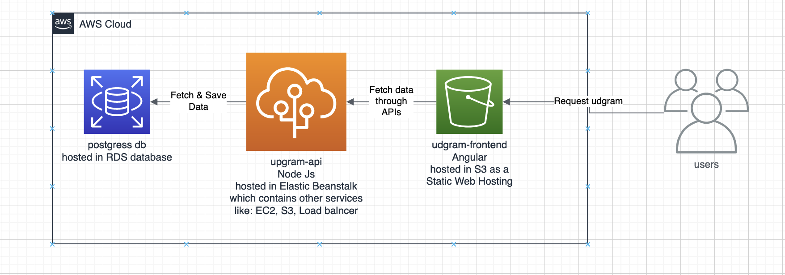

#Infrastructure
Users request Udgram website which its Frontend exists in the AWS S3 Bucket which fetch the data through API from AWS Beanstalk that fetchs and save data through AWS RDS postgress db.

##AWS
###RDS DB Postgres
The Elastic Beanstalk server uses the AWS RDS DB Postgres as the database to store and fetch data from.

Endpoint: `database-1.c3soxvg7hl4u.us-east-1.rds.amazonaws.com`
Port: `5432`

###Beanstalk
The udgram application server is deployed in AWS Elastic Beanstalk service, which make it easy to deploy as it handle the S3, EC2, Loadbalncer.

Url: http://udagrammagdy-env-1.eba-mjpbdfz9.us-east-1.elasticbeanstalk.com/

###S3
The udgram frontend website is hosted usign AWS S3 Bucket as a Static Web Hosting

Bucket website endpoint: http://frontendmagdy.s3-website-us-east-1.amazonaws.com
