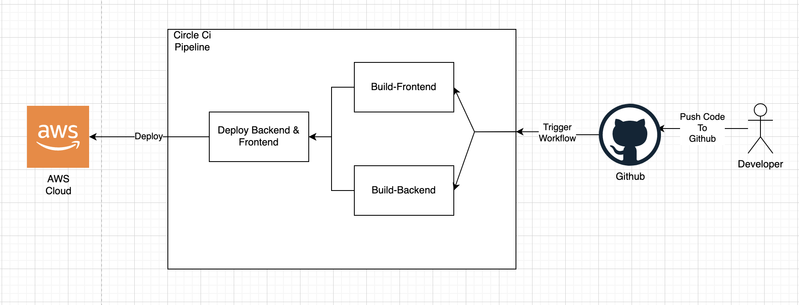

# Pipeline
Developer push the code to the Github server which the CircleCi watches and then trigers the workflow that Install, Build, and Deploy the Frontend & Backend application to the end users.

The Workflow consist of:
- Build Frontend:
This job consist of Installing Dependencies, and Build the frontend app.
- Build Backend:
This job consist of Installing Dependencies, and Build the Backend server.
- Deploy:
This job consist of setup the AWS CLI and AWS EB CLI, and deploy the frontend website and backend server to AWS.

The `Build Frontend` and `Build Backend` runs first in parallel and then when the both finish successfuly the `Deploy` job will run.
